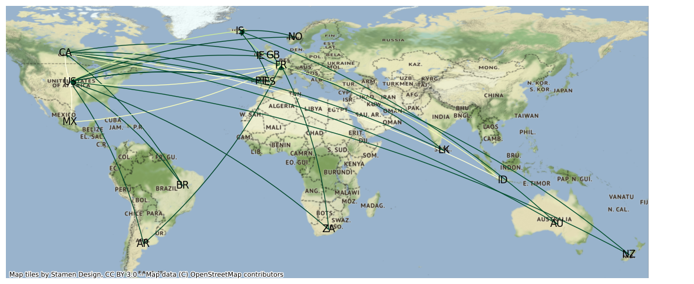

# Graph Structure Learning Experiments

Toy project for evaluating the applicability of Graph Structure Learning on different tasks:

1. Metro-lines traffic prediction
2. Individual whale movement
3. Whale search trends across countries

## Graph Structure Learning

Graph Structure Learning (GSL) is a method that aims at jointly learning the structure of a graph and an objective that relies on it.

This [short article](https://simonpop.github.io/graph-structure-learning.html) explains it in theory on my blog.

## 🚉 Metro-lines traffic prediction

### Data

The data for this task has been generated to allow more freedom and clarity on the role of GSL in the obtained results. 

A Markov model framework has been used to generate the data using a pre-defined graph structure: 

1. Define a graph structure: create edges & nodes, and normalize edge out-weights to sum to 1 (including self edges).
2. Define an initial state: the number of people at each station.
3. For *n* iterations simulate the Markov process: For each node, redistribute the population to other nodes according to weights.

## 🐋 Whale search trends

In this task, we will try demonstrating we can predict whale search trends using the MTGNN model from [Connecting the Dots: Multivariate Time Series Forecasting with Graph Neural Networks](https://arxiv.org/abs/2005.11650), a time-series forecasting paper learning a graph on the given multi-series.

To showcase that ability, we will use [Google Trends](https://trends.google.com/trends/explore?date=today%205-y&q=%2Fg%2F121dcm9p) data on the search frequency of the subject: `Whale (Animal)`.

This should give a proxy on whale apparitions on the coasts of different countries.

We hope the model can learn to predict search frequency in different locations and learn a relevant underlying graph structure along the way.

### 📈 The Data

> The data we use is both noisy and a naive approximation of real whale apparition frequency due to both bias in Google use in different places, accessibility and popularity of whale observation. However, the data is rich enough and allows for a fun exploration of Graph Structure Learning 😄

#### Data Acquisition

Google Trends data is publicly available and can be scrapped using its API. 
We use the [PyTrends](https://pypi.org/project/pytrends/) library to facilitate the gathering of this data in a pandas data frame.

The frequency of acquisition varies and averages around a point every 5 days.

#### Data Processing

Data from Google Trends is already pre-processed for taking values in a [0-100] interval: 
> Les résultats reflètent la proportion de recherches portant sur un mot clé donné dans une région et pour une période spécifiques, par rapport à la région où le taux d'utilisation de ce mot clé est le plus élevé (valeur de 100). Ainsi, une valeur de 50 signifie que le mot clé a été utilisé moitié moins souvent dans la région concernée, et une valeur de 0 signifie que les données pour ce mot clé sont insuffisantes.

For our learning objective, we will add some more processing:

1. Standardization: We standardize the series location by location, not only to center data around 0, but also in an attempt to remove bias over different Google usage at different locations.
2. Moving average for smoothing values.
2. Upsampling: we artificially increase the number of ticks in the dataset from a ~5d frequency to an hourly frequency.

### 🤖 The Model

Model in use is the [MTGNN](https://pytorch-geometric-temporal.readthedocs.io/en/latest/modules/root.html#torch_geometric_temporal.nn.attention.mtgnn.MTGNN) as implemented in the [PyTorch Geometric Temporal](https://pytorch-geometric-temporal.readthedocs.io/en/latest/index.html) library.

PyTorch Geometric Temporal is *"a temporal graph neural network extension library for PyTorch Geometric."*. It provides direct access to this model, from its catalog.

#### Hyperparameters

One of the biggest challenge for us is overfitting. The model, by default, is quite large compared to our dataset. 

We will therefore use different methods to try and regularize our model:
- Adam optimizer with `weights decay` (L2 regularization)
- Large `dropout` value
- `Upsampling` of the data as mentioned above
- Small `hidden dimensions`

### 📊 Results

The model manages to learn the time series easily knowing that it has a very periodic behavior.

However, the model's learned graph does not have to show cluster behavior to succeed since any time series does bring the same kind of information.

## 🐋 Whale movement

A second task will be to try and predict the movement of individual whales in the ocean.

To do that, we will simplify the context, and use the `h3` library to discretize movement into hexagons.

### Data

#### Data Acquisition

The data comes from the [Movebank](https://www.movebank.org/cms/webapp?gwt_fragment=page=search_map) data base.

> *Movebank is a free, online database of animal tracking data hosted by the Max Planck Institute of Animal Behavior.*

### 📊 Results

[TODO]
